# Income Classification Project
Demographic data has been obtained by an advertising agency.  In order to personalize advertisements, we are interested in predicting if a given user has income greater than $50K based on demographics.

This is an open-ended classification project for the Data Science program at [K2 Data Science](http://k2datascience.com).

### Assumptions and Approach
Data for this project was obtained from the UCI  [Machine Learning Repository ](http://www.basketball-reference.com/leagues/NBA_2017_per_game.html) of the University of California, Irvine.  The data was already divided into training and test sets.  The original data extraction was completed by Barry Becker using the 1994 Census database.  Records were extracted using the following conditions: ((AAGE>16) && (AGI>100) && (AFNLWGT>1)&& (HRSWK>0))

### Cleaning the Data
The training data set contained 32,561 records and 15 features.  A list of features and their descriptions can be found on the UCI website.

The obtained data required minimum cleaning.  Tasks were primarily limited to string manipulation and null value handling.  Only 3 features ('workclass', 'occupation', 'native_country') were found to contain null values.  A large proportion of records containing a null value for 'workclass' also contained a null value for 'occupation'.  Overall there were 2,399 records containing at least one null value with 2,066 of those records corresponding to an income <= $50K.  It was decided to simply remove the records containing null values.

The features 'fnlwgt' and 'education' were dropped from the data set prior to modeling.  'fnlwgt' corresponds to demographic weights utilized by the census and is not useful for our task.  'education' is being dropped since the feature 'education_num' captures the same information in a numerical format.

### Data Exploration
A histogram was created to view the variable distribution for all numerical features.

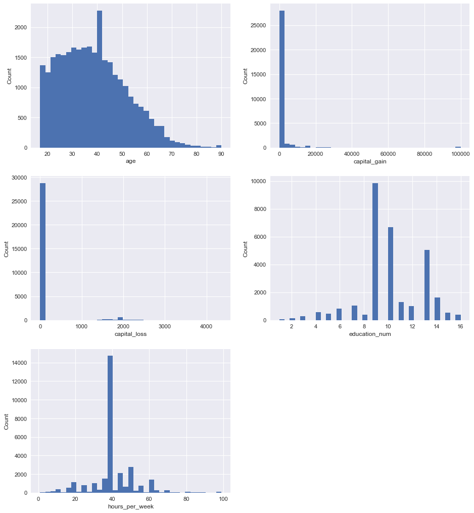

Box plots were then created to view how earnings were distributed in relation to age, education, and hours worked per week.

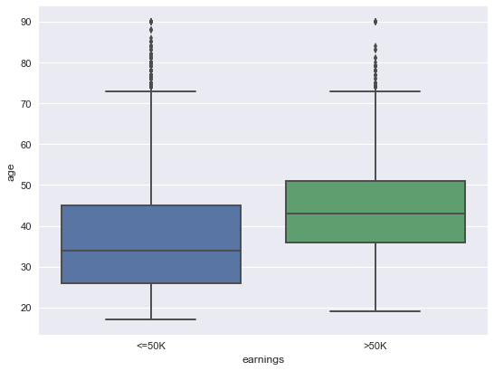

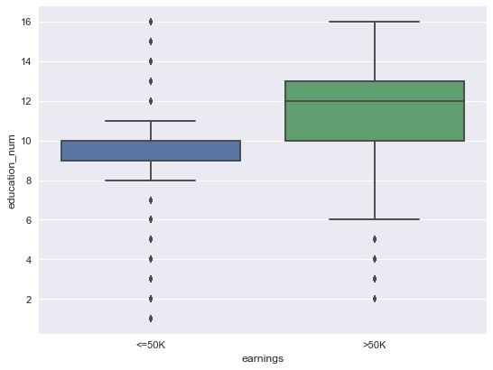

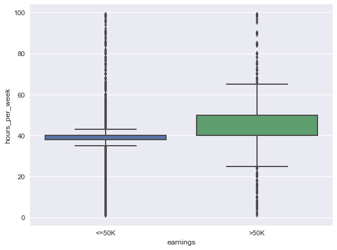

### Classification Model Evaluation
Numerical formatting was limited to standardization of features and was only utilized for models that are sensitive to unstandardized data.  Categorical formatting consisted of One Hot Encoding.

The models were then evaluated using all available predictor variables.  The scikit-learn library was utilized for each model.  For simplicity and consistency all models were compared by mean cross validation scores.  Additional model metrics can be found in the accompanying jupyter notebook.

#### Decision Tree
Resulted in a mean cross validation score of approximately 0.8507

#### Random Forest
Resulted in a mean cross validation score of approximately 0.8477

#### Support Vector Machine (Linear Kernal)
Resulted in a mean cross validation score of approximately 0.8469

#### Support Vector Machine (Polynomial Kernal)
Resulted in a mean cross validation score of approximately 0.8494

#### Support Vector Machine (RBF Kernal)
Resulted in a mean cross validation score of approximately 0.7510

#### Logistic Regression
Resulted in a mean cross validation score of approximately 0.8478

#### Ensemble utilizing hard voting (composed of Logistic Regression, Linear Support Vector Machine, and Decision Tree)
Resulted in a mean cross validation score of approximately 0.8491

#### Gradient Boosting
Resulted in a mean cross validation score of approximately 0.8614

### Final Model
Based on the results above the Gradient Boosting Classifier was selected for further testing.  Limited hyper-parameter tuning was completed utilizing GridSearchCV in scikit-learn.  The final selected hyper-parameters were as follows: max_depth=2, learning_rate=0.1, n_estimators=1,500.

The confusion matrix and ROC curve for the final cross validation of the training data is shown below.

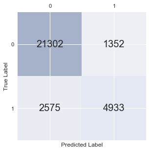

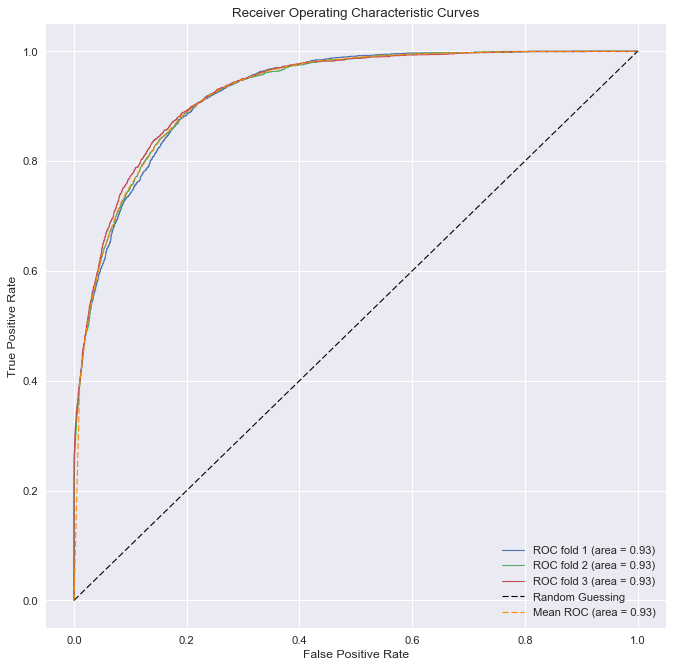

### Model Test Data Performance
The confusion matrix, ROC curve and classification report for the unbalanced model are provided below.  Labels of 0 represent salaries <=$50K while labels of 1 represent salaries >$50K.

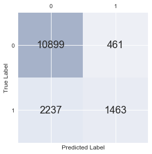

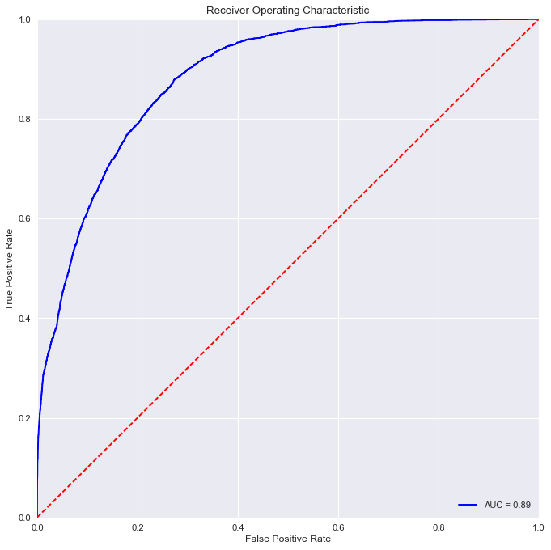

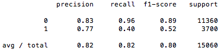

It is clear that the model was slightly over-fit.  This is likely a result of class imbalance in the training data set where the ratio of salaries <=$50K to salaries >$50K was 3.02.

### Addressing Training Set Class Imbalance
As shown above, if class imbalance is not accounted for prior to training, the model tends to favor a prediction of <=$50K.

Depending on the priority of our advertisement, it may be advantageous for our model to perform this way.  If we are interested in capturing the all users who may fit into the category of <=$50K and are less concerned with misclassification of users with higher salaries, we could leave the model as-is.  However, addressing this imbalance will allow the model to not only perform better with salaries >$50K, but it will likely lead to a more robust model overall. To achieve this goal, the model was re-trained with a sample weight of 3 applied to all samples with a salary >$50K.

### Balanced Model Test Data Performance
The confusion matrix, ROC curve and classification report for the balanced model are provided below.  Labels of 0 represent salaries <=$50K while labels of 1 represent salaries >$50K.

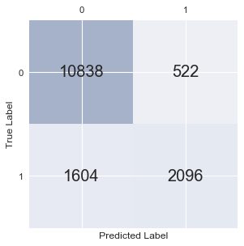

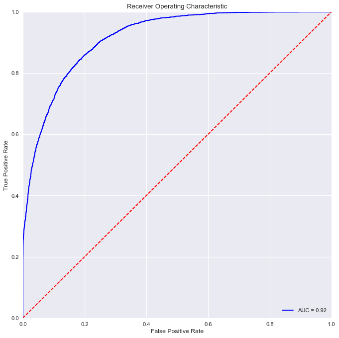

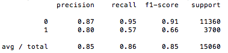

It is observed that the balanced model has a greatly improved performance in classifying salaries >$50K with only a slight decrease in performance classifying lower salaries.  The overall model performance increases slightly as well with the auc value improving from 0.89 to 0.92.
